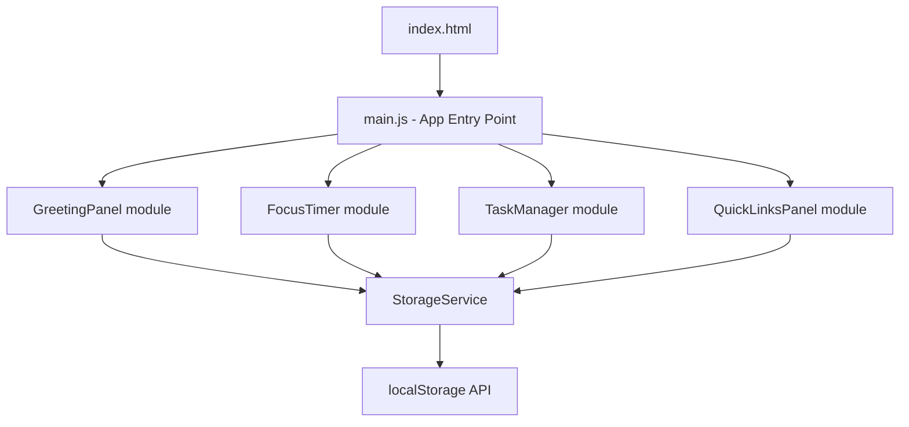

# Design Document: To-Do List Dashboard

## Overview

The To-Do List Dashboard is a single-page web application (SPA) built entirely with HTML, CSS, and Vanilla JavaScript. It runs entirely client-side with no backend, no build step, and no external dependencies. All persistent state is stored in the browser's `localStorage` API.

The dashboard is composed of four independent panels rendered on a single page:

1. **Greeting Panel** — displays the current time, date, and a time-aware greeting
2. **Focus Timer** — a 25-minute Pomodoro countdown timer
3. **Task Manager** — a full CRUD to-do list
4. **Quick Links Panel** — user-defined shortcut buttons to external URLs

Each panel is self-contained with its own state management logic, but all panels share a common `StorageService` for reading and writing to `localStorage`.

---

## Architecture

The application follows a **module-per-panel** architecture. Each panel is implemented as a JavaScript module (using ES Modules via `<script type="module">`) that owns its DOM subtree, its in-memory state, and its event listeners. There is no global mutable state shared between panels except through `localStorage`.



### Key Architectural Decisions

- **No framework**: Vanilla JS keeps the bundle size at zero and removes any dependency risk. DOM manipulation is done directly via `document.querySelector` and `innerHTML`/`textContent` assignments.
- **ES Modules**: Each panel lives in its own `.js` file, imported by `main.js`. This avoids global namespace pollution without requiring a bundler.
- **Event delegation**: Each panel attaches a single event listener to its root container element and uses `event.target.closest('[data-action]')` to handle clicks, reducing listener count.
- **Defensive localStorage access**: All reads and writes are wrapped in `try/catch`. If `localStorage` is unavailable or throws, the app continues with in-memory state and shows a non-blocking warning banner.

---

## Components and Interfaces

### `StorageService`

A thin wrapper around `localStorage` that handles serialization, deserialization, and error recovery.

```js
// src/services/StorageService.js
export const StorageService = {
  read(key, fallback = null),       // returns parsed JSON or fallback
  write(key, value),                // serializes to JSON, returns { ok: boolean, error? }
  isAvailable(),                    // returns boolean
};
```

**Storage keys:**
| Key | Value type | Description |
|---|---|---|
| `todo_dashboard_tasks` | `Task[]` | Array of task objects |
| `todo_dashboard_links` | `Link[]` | Array of link objects |
| `todo_dashboard_theme` | `"light" \| "dark"` | Active color theme; defaults to `"light"` if absent |
| `todo_dashboard_username` | `string \| null` | User's display name for personalized greeting; absent means generic greeting |

---

### `GreetingPanel`

Reads the system clock on load and sets a `setInterval` to refresh every 60 seconds. Also manages a name input control that allows the user to personalize the greeting.

```js
// src/panels/GreetingPanel.js
export function initGreetingPanel(rootEl)
```

**Internal state:**
```js
{
  userName: string | null,   // trimmed name from localStorage; null means generic greeting
}
```

**Internal functions:**
- `getGreeting(hour: number): string` — pure function mapping hour → greeting string
- `formatTime(date: Date): string` — formats to 12-hour AM/PM
- `formatDate(date: Date): string` — formats to "Day, Month DD"
- `formatGreeting(baseGreeting: string, name: string | null): string` — pure function; returns `"${baseGreeting}, ${name}"` when `name` is a non-empty trimmed string, otherwise returns `baseGreeting` unchanged
- `render(rootEl, state)` — updates DOM with current state

**Name input behavior:**
- The panel renders a text input (and submit button) for the user's display name.
- On submit: if the trimmed value is non-empty and ≤ 50 characters, `userName` is updated, the greeting re-renders, and the name is persisted via `StorageService.write('todo_dashboard_username', trimmedName)`.
- If the trimmed value is empty or whitespace-only, `userName` is set to `null`, the generic greeting is restored, and the stored name is cleared (`StorageService.write('todo_dashboard_username', null)`).
- If the trimmed value exceeds 50 characters, an inline validation message is shown and no state change occurs.
- On load, `StorageService.read('todo_dashboard_username', null)` is called; a valid stored name populates `userName` immediately.

---

### `FocusTimer`

Manages a countdown timer using `setInterval` with 1-second ticks. Timer state is **not** persisted to `localStorage` (per Requirement 2.8 — resets on page load).

```js
// src/panels/FocusTimer.js
export function initFocusTimer(rootEl)
```

**Internal state:**
```js
{
  remaining: 1500,   // seconds remaining (25 * 60)
  running: false,    // whether interval is active
  intervalId: null,  // handle for clearInterval
}
```

**Internal functions:**
- `formatCountdown(seconds: number): string` — converts seconds to "MM:SS"
- `tick(state, render)` — decrements remaining, stops at 0, triggers end cue
- `notifyEnd()` — plays a short audio beep via the Web Audio API (no external file needed)

---

### `TaskManager`

Manages the full task lifecycle. Tasks are stored in memory as an array and synced to `localStorage` on every mutation.

```js
// src/panels/TaskManager.js
export function initTaskManager(rootEl)
```

**Internal state:**
```js
{
  tasks: Task[],
  editingId: string | null,   // id of task currently in edit mode
}
```

**Internal functions:**
- `addTask(description: string): Result` — validates and appends
- `editTask(id: string, description: string): Result` — validates and updates
- `toggleComplete(id: string): void`
- `deleteTask(id: string): void`
- `validateDescription(text: string, tasks: Task[], excludeId?: string): ValidationResult` — validates length/whitespace rules **and** duplicate detection; `excludeId` is the id of the task being edited (so a task is not considered a duplicate of itself); duplicate check is trimmed, case-insensitive comparison against all tasks except the one with `excludeId`
- `persist(tasks: Task[]): void` — writes to StorageService, shows error on failure
- `render(rootEl, state)` — full re-render of task list

---

### `QuickLinksPanel`

Manages user-defined link shortcuts. Links are stored in memory and synced to `localStorage` on every mutation.

```js
// src/panels/QuickLinksPanel.js
export function initQuickLinksPanel(rootEl)
```

**Internal state:**
```js
{
  links: Link[],
}
```

**Internal functions:**
- `addLink(label: string, url: string): Result` — validates and appends
- `deleteLink(id: string): void`
- `validateLink(label: string, url: string): ValidationResult` — validates label length, URL format, duplicate check, max-50 limit
- `persist(links: Link[]): void`
- `render(rootEl, state)`

---

### `ThemeService`

A dedicated service (or thin extension of `StorageService`) that manages the active color theme. It applies the theme by setting a `data-theme` attribute on the `<html>` element, which CSS custom-property rules use to switch palettes.

```js
// src/services/ThemeService.js
export const ThemeService = {
  apply(theme: Theme): void,          // sets document.documentElement.dataset.theme = theme
  toggle(current: Theme): Theme,      // returns "dark" if current is "light", else "light"
  load(): Theme,                      // reads from StorageService; returns "light" if absent
  save(theme: Theme): Result,         // persists via StorageService; returns { ok, error? }
};
```

**Theme switching mechanism:**
- `apply` sets `document.documentElement.setAttribute('data-theme', theme)` (or equivalent `dataset` assignment).
- CSS rules use `[data-theme="dark"] { ... }` selectors to override custom properties for the dark palette.
- On Dashboard load, `ThemeService.load()` is called before any panel renders, ensuring the correct theme is applied before the first paint.

---

## Data Models

### `Theme`

```js
type Theme = "light" | "dark";
```

The active color scheme of the Dashboard. Defaults to `"light"` when no persisted value exists.

---

### `Task`

```js
{
  id: string,           // crypto.randomUUID() or Date.now().toString()
  description: string,  // 1–500 characters, trimmed
  completed: boolean,   // false on creation
  createdAt: number,    // Date.now() timestamp
}
```

### `Link`

```js
{
  id: string,           // crypto.randomUUID() or Date.now().toString()
  label: string,        // 1–50 characters, trimmed
  url: string,          // must start with "http://" or "https://", max 2048 chars
  createdAt: number,    // Date.now() timestamp
}
```

### `ValidationResult`

```js
{
  valid: boolean,
  error: string | null,   // human-readable message shown inline
}
```

### `Result`

```js
{
  ok: boolean,
  error: string | null,
}
```

### `TimerState`

```js
{
  remaining: number,    // seconds, 0–1500
  running: boolean,
  intervalId: number | null,
}
```

---

## Correctness Properties

*A property is a characteristic or behavior that should hold true across all valid executions of a system — essentially, a formal statement about what the system should do. Properties serve as the bridge between human-readable specifications and machine-verifiable correctness guarantees.*

### Property 1: Greeting correctness for all hours

*For any* integer hour value in [0, 23], `getGreeting(hour)` SHALL return exactly one of "Good Morning", "Good Afternoon", "Good Evening", or "Good Night", and the returned greeting SHALL match the time-of-day range defined in Requirements 1.4–1.7 (Morning: 5–11, Afternoon: 12–17, Evening: 18–21, Night: 22–4).

**Validates: Requirements 1.4, 1.5, 1.6, 1.7**

---

### Property 2: Time format invariant

*For any* valid `Date` object, `formatTime(date)` SHALL return a string matching the pattern `/^\d{1,2}:\d{2} (AM|PM)$/`, with hours in [1, 12] and minutes in [00, 59].

**Validates: Requirements 1.1**

---

### Property 3: Date format invariant

*For any* valid `Date` object, `formatDate(date)` SHALL return a string matching the pattern of a full weekday name, a comma, a full month name, and a one-or-two-digit day (e.g., "Thursday, May 21").

**Validates: Requirements 1.2**

---

### Property 4: Countdown format invariant

*For any* integer number of seconds in [0, 1500], `formatCountdown(seconds)` SHALL return a string matching the pattern `/^\d{2}:\d{2}$/` where the minutes component is in [00, 25] and the seconds component is in [00, 59].

**Validates: Requirements 2.1, 2.3**

---

### Property 5: Task description validation rejects invalid input

*For any* string that is either composed entirely of whitespace characters (spaces, tabs, newlines) or whose trimmed length exceeds 500 characters, `validateDescription(text)` SHALL return `{ valid: false }`.

**Validates: Requirements 3.2, 3.5**

---

### Property 6: Task description validation accepts valid input

*For any* string whose trimmed length is between 1 and 500 characters (inclusive) and is not whitespace-only, `validateDescription(text)` SHALL return `{ valid: true }`.

**Validates: Requirements 3.1, 3.4**

---

### Property 7: Task list persistence round-trip

*For any* array of `Task` objects, writing it via `StorageService.write` and then reading it back via `StorageService.read` SHALL produce an array that is deeply equal to the original, preserving all fields (`id`, `description`, `completed`, `createdAt`).

**Validates: Requirements 3.8, 3.9, 5.2, 5.3**

---

### Property 8: Link list persistence round-trip

*For any* array of `Link` objects, writing it via `StorageService.write` and then reading it back via `StorageService.read` SHALL produce an array that is deeply equal to the original, preserving all fields (`id`, `label`, `url`, `createdAt`).

**Validates: Requirements 4.6, 4.7, 5.2, 5.3**

---

### Property 9: URL validation rejects non-http/https schemes

*For any* string that does not begin with `"http://"` or `"https://"`, `validateLink(label, url)` SHALL return `{ valid: false }`, regardless of the label value.

**Validates: Requirements 4.3**

---

### Property 10: Link cap enforcement

*For any* link list already containing exactly 50 entries, calling `addLink` with a valid label and URL SHALL return `{ ok: false }` and leave the list length unchanged at 50.

**Validates: Requirements 4.10**

---

### Property 11: Toggle completion is an involution

*For any* task with any initial `completed` value, toggling its completion status twice SHALL return the task to its original `completed` state (i.e., `toggle(toggle(task)).completed === task.completed`).

**Validates: Requirements 3.6**

---

### Property 12: Theme toggle is an involution

*For any* `Theme` value (`"light"` or `"dark"`), calling `ThemeService.toggle` twice SHALL return the original theme (i.e., `toggle(toggle(theme)) === theme`).

**Validates: Requirements 7.2, 7.3**

---

### Property 13: Duplicate detection is case-insensitive and trim-insensitive

*For any* task list and any description whose trimmed, lowercased value matches the trimmed, lowercased value of at least one existing task in the list (excluding the task identified by `excludeId`, if provided), `validateDescription(text, tasks, excludeId)` SHALL return `{ valid: false }`. Conversely, for any description whose trimmed, lowercased value does not match any remaining task, `validateDescription` SHALL return `{ valid: true }`.

**Validates: Requirements 8.1, 8.2, 8.3, 8.4**

---

### Property 14: Greeting format with name always produces "BaseGreeting, Name" pattern

*For any* non-empty base greeting string and any valid name string (trimmed length 1–50, non-whitespace-only), `formatGreeting(baseGreeting, name)` SHALL return a string equal to `baseGreeting + ", " + trimmedName`, and the result SHALL contain both the base greeting and the trimmed name separated by `", "`.

**Validates: Requirements 9.2**

---

## Error Handling

| Scenario | Behavior |
|---|---|
| `localStorage` unavailable on init | Show a persistent non-blocking warning banner; operate with empty in-memory state |
| `localStorage` write fails | Show an inline error message in the affected panel; do not crash |
| `localStorage` contains unparseable JSON | Treat as empty; show non-blocking warning banner |
| Task description empty or whitespace-only | Show inline validation message; do not add/save task |
| Task description > 500 chars | Show inline validation message; do not add/save task |
| Task description is a duplicate (trimmed, case-insensitive match) | Show inline validation message indicating duplicate; do not add/save task |
| Link label empty or whitespace-only | Show inline validation message; do not add link |
| Link URL missing http/https prefix | Show inline validation message; do not add link |
| Link URL > 2048 chars | Show inline validation message; do not add link |
| Duplicate link URL | Show inline validation message; do not add link |
| Link list at 50-item cap | Show inline message; do not add link |
| Timer already running on start press | Silently ignore; continue countdown |
| `Date` / clock unavailable | Show "Hello" fallback; omit time and date fields |
| Theme `localStorage` write fails | Show inline error message in the theme toggle area indicating the theme preference could not be saved; continue operating with the currently applied theme |
| User name `localStorage` write fails | Show inline error message in the Greeting_Panel indicating the name could not be saved; continue displaying the personalized greeting for the current session |

All error messages are displayed inline within the relevant panel. No modal dialogs or page-blocking alerts are used. Errors are cleared when the user next interacts with the relevant input.

---

## Testing Strategy

### Unit Tests (Vitest)

Unit tests cover pure functions and validation logic with specific examples and edge cases.

**GreetingPanel:**
- `getGreeting(hour)` — test each boundary: 5, 12, 18, 22, 0, 4
- `formatTime(date)` — midnight (12:00 AM), noon (12:00 PM), 1:05 PM
- `formatDate(date)` — known date produces expected string
- `formatGreeting("Good Morning", "Alex")` → `"Good Morning, Alex"`
- `formatGreeting("Good Night", null)` → `"Good Night"`
- `formatGreeting("Good Afternoon", "  Alex  ")` → `"Good Afternoon, Alex"` (trimmed)
- Name input: submitting a valid name updates greeting and persists to storage
- Name input: submitting empty/whitespace clears stored name and reverts to generic greeting
- Name input: submitting a name > 50 chars shows validation message and does not persist

**FocusTimer:**
- `formatCountdown(0)` → `"00:00"`
- `formatCountdown(1500)` → `"25:00"`
- `formatCountdown(90)` → `"01:30"`

**TaskManager:**
- `validateDescription("", [], undefined)` → invalid
- `validateDescription("   ", [], undefined)` → invalid
- `validateDescription("a".repeat(501), [], undefined)` → invalid
- `validateDescription("Buy milk", [], undefined)` → valid
- `validateDescription("buy milk", [{ description: "Buy Milk", ... }], undefined)` → invalid (duplicate, case-insensitive)
- `validateDescription("  Buy Milk  ", [{ description: "buy milk", ... }], undefined)` → invalid (duplicate, trim-insensitive)
- `validateDescription("Buy milk", [{ id: "1", description: "Buy Milk", ... }], "1")` → valid (editing same task, excluded from duplicate check)
- `addTask` with valid input increases task list length by 1
- `deleteTask` removes the correct task by id
- `toggleComplete` flips the `completed` flag

**ThemeService:**
- `ThemeService.toggle("light")` → `"dark"`
- `ThemeService.toggle("dark")` → `"light"`
- `ThemeService.load()` with no stored value → `"light"`
- `ThemeService.load()` with stored `"dark"` → `"dark"`
- `ThemeService.apply("dark")` sets `document.documentElement.dataset.theme` to `"dark"`
- `ThemeService.save` then `ThemeService.load` round-trip returns same value

**QuickLinksPanel:**
- `validateLink("", "https://example.com")` → invalid
- `validateLink("Example", "ftp://example.com")` → invalid
- `validateLink("Example", "https://example.com")` → valid
- `addLink` when list has 50 items → rejected

**StorageService:**
- `write` then `read` round-trip for tasks
- `read` with missing key returns fallback
- `read` with corrupted JSON returns fallback

### Property-Based Tests (fast-check)

Property-based tests use [fast-check](https://github.com/dubzzz/fast-check) to verify universal properties across randomly generated inputs. Each test runs a minimum of **100 iterations**.

Each test is tagged with a comment in the format:
`// Feature: todo-dashboard, Property N: <property text>`

**Property 1 — Greeting correctness:**
Generate arbitrary integers in [0, 23] via `fc.integer({ min: 0, max: 23 })`; assert `getGreeting(hour)` returns the correct greeting per the time-range rules (Morning: 5–11, Afternoon: 12–17, Evening: 18–21, Night: 22–4).

**Property 2 — Time format invariant:**
Generate arbitrary `Date` objects via `fc.date()`; assert `formatTime(date)` matches `/^\d{1,2}:\d{2} (AM|PM)$/`.

**Property 3 — Date format invariant:**
Generate arbitrary `Date` objects via `fc.date()`; assert `formatDate(date)` matches the expected weekday/month/day pattern.

**Property 4 — Countdown format invariant:**
Generate arbitrary integers in [0, 1500] via `fc.integer({ min: 0, max: 1500 })`; assert `formatCountdown(n)` matches `/^\d{2}:\d{2}$/`.

**Property 5 — Task description validation rejects invalid input:**
Generate whitespace-only strings via `fc.stringOf(fc.constantFrom(' ', '\t', '\n'), { minLength: 1 })` and over-length strings via `fc.string({ minLength: 501 })`; assert `validateDescription` returns `{ valid: false }`.

**Property 6 — Task description validation accepts valid input:**
Generate strings with `fc.string({ minLength: 1, maxLength: 500 })` filtered to non-whitespace-only; assert `validateDescription` returns `{ valid: true }`.

**Property 7 — Task persistence round-trip:**
Generate arbitrary `Task[]` arrays via a custom `fc.record` arbitrary; write then read via `StorageService`; assert deep equality.

**Property 8 — Link persistence round-trip:**
Generate arbitrary `Link[]` arrays via a custom `fc.record` arbitrary; write then read via `StorageService`; assert deep equality.

**Property 9 — URL prefix validation:**
Generate strings that do not start with `"http://"` or `"https://"` via `fc.string()` filtered accordingly; assert `validateLink(label, url)` returns `{ valid: false }`.

**Property 10 — Link cap enforcement:**
Generate a list of exactly 50 valid links; attempt to add one more valid link; assert `addLink` returns `{ ok: false }` and list length remains 50.

**Property 11 — Toggle involution:**
Generate arbitrary `Task` objects with `fc.record({ completed: fc.boolean(), ... })`; toggle twice; assert `completed` equals original value.

**Property 12 — Theme toggle is an involution:**
Generate arbitrary `Theme` values via `fc.constantFrom("light", "dark")`; call `ThemeService.toggle` twice; assert the result equals the original theme value.
`// Feature: todo-dashboard, Property 12: theme toggle is an involution`

**Property 13 — Duplicate detection is case-insensitive and trim-insensitive:**
Generate a non-empty task list via a custom `fc.array(fc.record({ id: fc.uuid(), description: fc.string({ minLength: 1, maxLength: 500 }), ... }))` and pick a random existing description; generate a variant by randomly changing its case and/or adding leading/trailing whitespace; assert `validateDescription(variant, tasks, undefined)` returns `{ valid: false }`. Also generate descriptions that do not match any existing task (after trim+lowercase) and assert `{ valid: true }`.
`// Feature: todo-dashboard, Property 13: duplicate detection is case-insensitive and trim-insensitive`

**Property 14 — Greeting format with name always produces "BaseGreeting, Name" pattern:**
Generate arbitrary non-empty base greeting strings via `fc.string({ minLength: 1 })` and valid name strings via `fc.string({ minLength: 1, maxLength: 50 })` filtered to non-whitespace-only; assert `formatGreeting(baseGreeting, trimmedName)` equals `baseGreeting + ", " + trimmedName`.
`// Feature: todo-dashboard, Property 14: greeting format with name always produces "BaseGreeting, Name" pattern`
